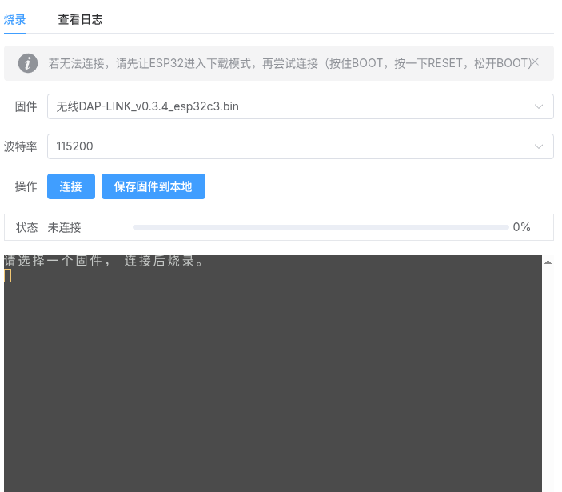

# ESP Flasher Component

A Vue 3 component for flashing ESP32 series microcontrollers directly from the browser using the Web Serial API. This component is based on `esptools-js`.

## Demo

[Live Demo - Wireless UART DIY Guide](https://yunsi.studio/wireless-debugger/docs/diy/uart/)



## Features

- Supports ESP32, ESP32-C3, ESP32-S3, and more.
- Built-in Xterm.js terminal for progress and logging.
- Support for multiple firmware image options.
- Dark mode support via prop.

## Usage

### Props

| Prop | Type | Description |
| :--- | :--- | :--- |
| `imageOptions` | `ImageOption[]` | An array of firmware images available for flashing. |
| `isDark` | `boolean` | (Optional) Toggle dark mode for the terminal. |

#### ImageOption Object

```typescript
type ImageOption = {
  value: string;  // Display name of the firmware
  link: string;   // Path/URL to the .bin file
  target: string; // Target chip (e.g., 'ESP32-C3', 'ESP32', 'ESP32-S3')
};
```

### Example

```vue
<script setup lang="ts">
import EspFlasher from './path/to/yunsi-toolbox/esp-flasher/EspFlasher.vue';
import { ref } from 'vue';

const isDark = ref(false);

const imageOptions = [
  {
    value: 'MyFirmware_v1.0_esp32c3.bin',
    link: '/downloads/firmware_c3.bin',
    target: 'ESP32-C3',
  },
  {
    value: 'MyFirmware_v1.0_esp32s3.bin',
    link: '/downloads/firmware_s3.bin',
    target: 'ESP32-S3',
  }
];
</script>

<template>
  <EspFlasher :imageOptions="imageOptions" :isDark="isDark" />
</template>
```

## Dependencies

- `vue`
- `xterm`
- `xterm-addon-fit`
- `crypto-js`

## Credits

This tool uses a modified version of [esptools-js](https://github.com/espressif/esptools-js).